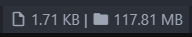

# FS Monitor

FS Monitor, short for Folder Size Monitor, is a simple extension that shows the file and folder sizes on the status bar of your current project in the followig format:

:page_with_curl: size | :file_folder: size

## Features

Simply shows the current file size and workspace size that you are working on, and

-   Easily disable with a click or a command or even in settings

-   Configure position and priority easily

-   Clean and easy to use

-   Can ignore node_modules from total workspace size

-   More features coming soon!

Wanna see it in action?

## Requirements

VSCode v1.38 or later

## Extension Settings

Settings:

-   `fsMonitor.enable`: Toggles the extension on or off
-   `fsMonitor.priority`: Change the priority on the status bar _higher is always closer to the left_
-   `fsMonitor.position`: Shows the sizes on the right/left side of the status bar
-   `fsMonitor.ignoreNodeModules`: Ignore node_modules folder from the total workspace size

## Known Issues

-   Extremely slow and clunky in large workspaces - Temp Fix: Disable extension before opening these workspaces

## Release Notes - See more in the [changelog](CHANGELOG.md)

### 1.0.0

Initial release of FSMonitor

---

**Enjoy!**
